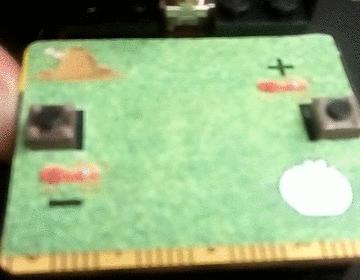
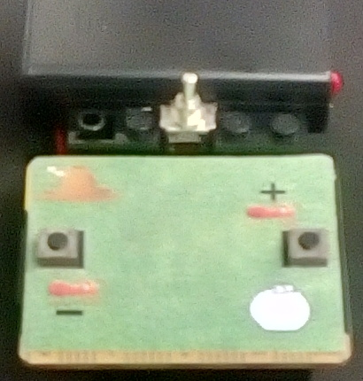

# Ant colony algorithm for micro:bit controller
This little project contains programs for the simulation of
an [ant colony algorithm](https://en.wikipedia.org/wiki/Ant_colony_optimization_algorithms)
on a [micro:bit](https://www.microbit.org/) controller. To get a first impression, see
the animation below.

In nature, ants build streets on their way to some food source because of a pheromone trace.
The street is not immediately present, as some ants probably are able to find a shorter way
to the food source, but after some time, the paths of the ants converge. This project is a
very simple simulation of this pheronome ant trail convergence.

## What is contained
The project consists of mainly 4 useful files:
1. `antcolony_simulation.py` contains a simulation of the ant colony algorithm usable directly in python.
   To run the script, just call	`python antcolony_simulation.py`.
  The ants then should move from upper left to lower right, and after some time, the path of the ants should converge.
2. `antcolony_microbit.py` contains the ant colony algorithm compileable at the homepage of microbit. The compiler
  can be found at https://python.microbit.org/v/2.0
3. `antcolony_microbit.hex` is the already compiled program (compiled February 2020). Just connect your 
  controller to your PC using USB, and copy the file to the controller. Afterwards, the program should run on your
  controller.
4. `overlay.jpg` is the overlay you can see in the upper animation. Dimensions are measured such that you just
  need to print the image, cut it out, and stick it on your controller. In my case, i used double-sided tape
  below and above of the LED-matrix of the controller. With a little more work (adding a switch to the battery
  and tinking a structure to cover controller, switch and battery), the result can look like this:

  

## Using the program on the controller
* the simulation is always random because of random decisions in the program, so
  every execution should be unique
* by holding the left button on the controller, you can increase the amount of ants (initially 3, maximal 7)
* by holding the right button on the controller, you can decrease the amount of ants (minimal 1)
* to restart the program, unplug the battery and plug it again (the reset switch at the back of the
  controller did not always work on my controller)

## What else to say
* Sorry for my bad-quality images and animations, but cheap smart phones have bad cameras :X
* The python code is for sure not an example of good python programming, but it was the
  first project i ever coded in python, so keep friendly
* Feel free to modify the programs, probably you want more ants to run at the beginning, or whatever. Have fun!
